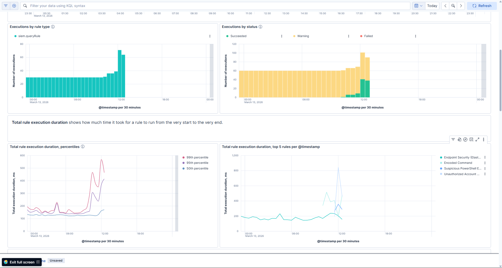
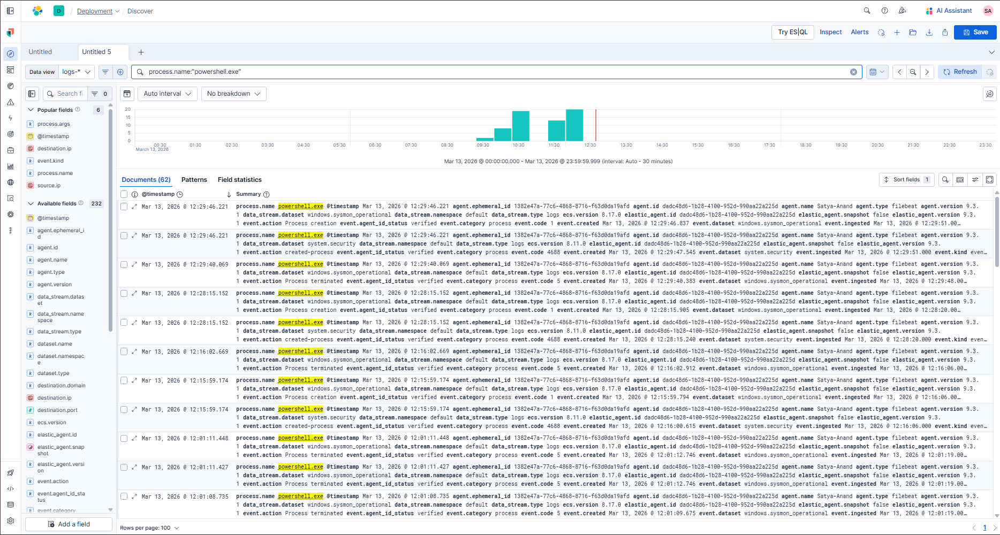
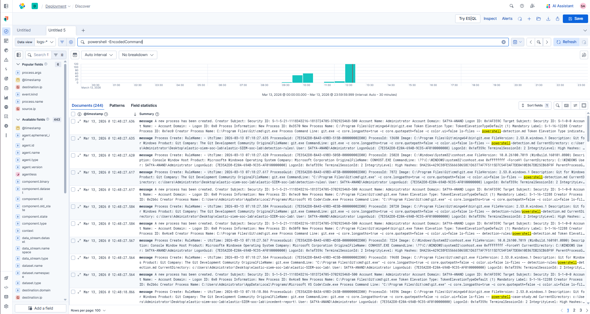
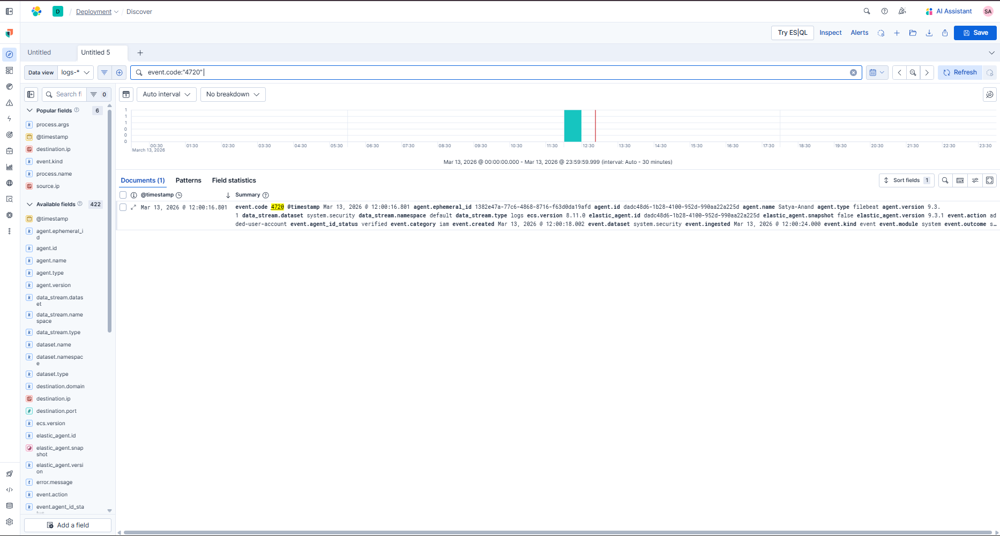
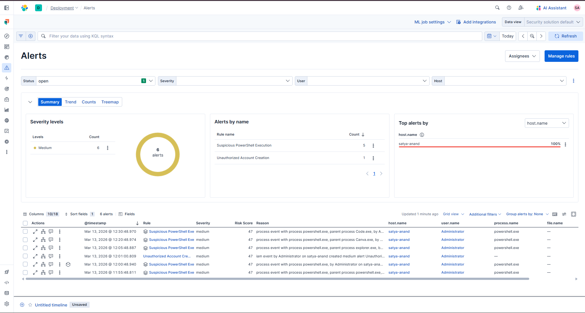
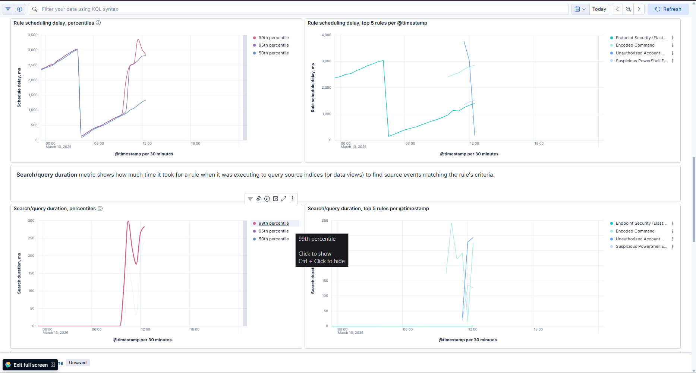
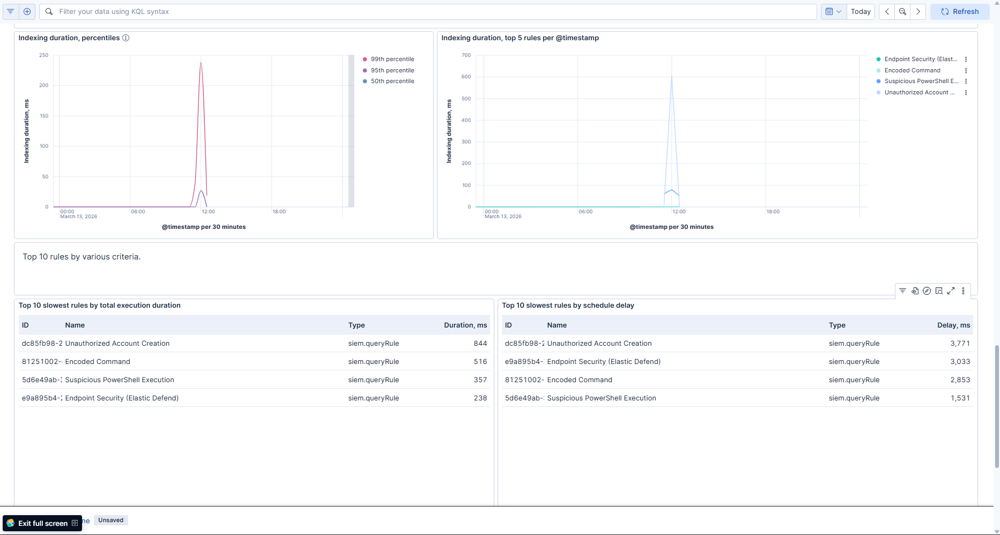

# Elastic SIEM SOC Monitoring Lab

Hands-on **Security Operations Center (SOC) monitoring lab** using Elastic Security SIEM to detect and investigate suspicious activity on Windows endpoints.

---

## Overview

This project demonstrates how a SOC analyst monitors endpoint activity using a Security Information and Event Management (SIEM) platform.

A Windows endpoint was monitored using **Elastic Agent**, which collected system telemetry and forwarded logs to **Elastic Security SIEM**. Detection rules were created to identify suspicious activity and generate alerts for investigation.

Simulated attack activities included:

- PowerShell execution
- Encoded PowerShell commands
- Unauthorized account creation

---

## Architecture

### Architecture Flow

Windows Endpoint  
↓  
Elastic Agent  
↓  
Elastic Security SIEM  
↓  
Detection Rules  
↓  
Security Alerts & Investigation  

Elastic Agent collects Windows security logs and forwards them to Elastic SIEM where detection rules analyze events and generate alerts.

---

## Technologies Used

- Elastic Security SIEM
- Elastic Agent
- Windows Event Logs
- PowerShell
- MITRE ATT&CK Framework

---

## Attack Simulations

### Suspicious PowerShell Execution

Command executed:

powershell -ExecutionPolicy Bypass

Detection Query:

process.name:powershell.exe

MITRE ATT&CK Technique:

T1059.001 – PowerShell

---

### Encoded PowerShell Command

Command executed:

powershell -EncodedCommand aQBlAHgA

Detection Query:

process.name:powershell.exe

MITRE ATT&CK Technique:

T1027 – Obfuscated Commands

---

### Unauthorized Account Creation

Command executed:

net user hacker123 Password123! /add

Detection Query:

event.code:4720

MITRE ATT&CK Technique:

T1136 – Create Account

---

## Detection Rules

| Rule | Query |
|-----|------|
PowerShell Execution Detection | `process.name:powershell.exe` |
Unauthorized Account Creation | `event.code:4720` |

These rules generate alerts in Elastic SIEM when suspicious activity occurs.

---

## Investigation Workflow

1. Endpoint generates security event
2. Elastic Agent collects logs
3. SIEM detection rule evaluates event
4. Alert generated in SIEM
5. SOC analyst investigates activity

---

## MITRE ATT&CK Mapping

| Technique | Description |
|----------|-------------|
T1059.001 | PowerShell Execution |
T1027 | Obfuscated Commands |
T1136 | Account Creation |

---

## SIEM Investigation Screenshots

### PowerShell Execution Logs

---

### Encoded PowerShell Activity

---

### Unauthorized Account Creation Event

---

### SIEM Alerts Generated

---

### SIEM Dashboard Monitoring

---

## Project Structure

elastic-siem-soc-lab
│
├── README.md
│
├── architecture
│ ├── architecture.md
│ └── siem_architecture.png
│
├── detection-rules
│ └── powershell-detection.md
│
├── incident-report
│ ├── incident-timeline.md
│ └── powershell-case-study.md
│
└── screenshots
├── powershell_logs.png
├── encoded_command_logs.png
├── account_creation_event.png
├── siem_alerts.png
├── dashboard-1.png
├── dashboard-2.png
└── dashboard-3.png

---

## Skills Demonstrated

- SIEM Monitoring
- Windows Security Log Analysis
- Detection Rule Creation
- Security Alert Investigation
- MITRE ATT&CK Threat Mapping
- Incident Investigation Workflow

---

## Author

Satya Pragy Anand  
Cybersecurity | SOC Analyst