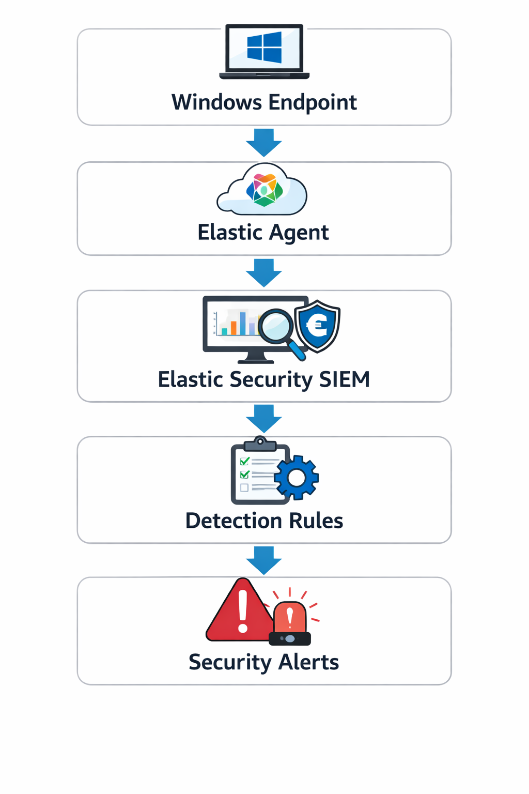

# SIEM Architecture

This lab demonstrates a basic Security Operations Center (SOC) monitoring architecture using Elastic Security SIEM.

The goal of the architecture is to collect endpoint telemetry from a Windows system, analyze the logs in a SIEM platform, and generate alerts when suspicious activity is detected.

---

## Architecture Overview

Windows Endpoint
↓
Elastic Agent
↓
Elastic Security SIEM
↓
Detection Rules
↓
Alerts & Investigation

---

## Components

### Windows Endpoint

The Windows endpoint acts as the monitored system.  
Security events such as process execution and account creation occur on this system.

Examples of simulated activity:

- PowerShell execution
- Encoded PowerShell commands
- Unauthorized user account creation

These activities generate security events in Windows logs.

---

### Elastic Agent

Elastic Agent is installed on the Windows endpoint.

Responsibilities:

- Collect Windows security logs
- Monitor endpoint activity
- Forward telemetry to Elastic SIEM

Elastic Agent acts as the **data collection layer** in this architecture.

---

### Elastic Security SIEM

Elastic Security SIEM receives logs from Elastic Agent and provides:

- Security event analysis
- Log search and investigation
- Detection rule creation
- Alert monitoring
- Security dashboards

This platform is used by SOC analysts to monitor endpoint activity.

---

### Detection Rules

Custom detection rules are created inside the SIEM to identify suspicious behavior.

Examples used in this project:

PowerShell execution

process.name:powershell.exe

Unauthorized account creation

event.code:4720

These rules generate alerts when matching events occur.

---

### Alerts & Investigation

When a detection rule is triggered:

1. An alert is generated in Elastic SIEM
2. The SOC analyst reviews the event
3. Logs and telemetry are analyzed
4. The activity is mapped to MITRE ATT&CK techniques

This process demonstrates a simplified **SOC investigation workflow**.

---

## Architecture Diagram

The architecture diagram below illustrates the flow of security data within the monitoring lab.

---

## Summary

This architecture demonstrates how endpoint telemetry can be collected, analyzed, and investigated using a SIEM platform.

Key capabilities demonstrated:

- Endpoint monitoring
- Security log collection
- Detection rule creation
- Alert generation
- Incident investigation